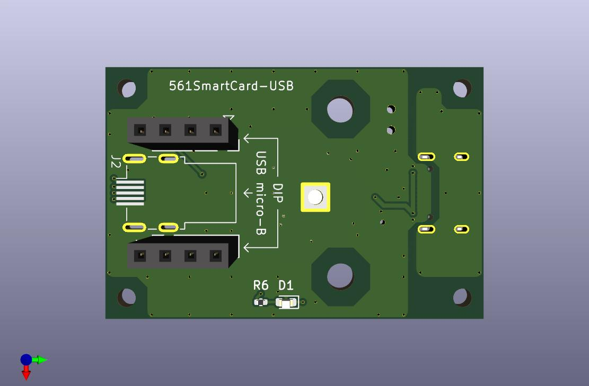
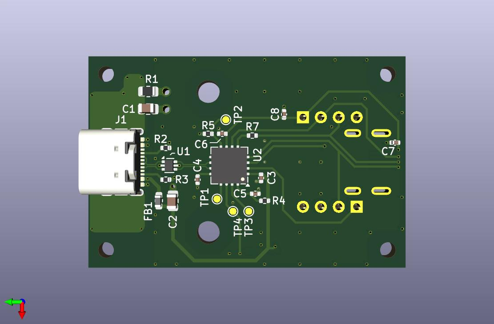

# 561SmartCard-USB - Smart Card Module to USB Bridge Board

スマートカード (ISO/IEC 7816) 互換モジュールを USB Type-C デバイスとして扱うための基板です。  
USB-スマートカードブリッジ IC 「SEC1110」を採用しており、CCID 準拠のスマートカードリーダとして動作します。

スマートカード互換モジュールは、USB micro-B または DIP (8 ピン) の 2 種類に対応します。  
DIP 形状のものは実物での確認を行っていないため、嵌合・動作しない可能性があります。

## ディレクトリ構成

- kicad - KiCAD 9 プロジェクト
- gerber_jlcpcb - JLCPCB 製造用ガーバ
- bom - 部品表  
  コンデンサ・抵抗等は、定格を満たせば互換品で問題ありません  
  (基本的に 5V を超える耐圧、1/10W 等)
- images-for-doc - 本ドキュメント用の画像

## 対応スマートカード互換モジュールのピンアサイン

### USB micro-B

1. VCC
2. RST_N
3. CLK
4. IO
5. GND

### DIP

△ が 1 番ピンです (見切れていますが、画像 1 枚目右上)。  
ここから反時計周りに 2, 3, ... 8 番ピンとなります。

1. VCC
2. RST_N
3. CLK
4. C4
5. C8
6. IO
7. NC
8. GND

## 備考

- 手実装を前提に SEC1110 (QFP) の Thermal Pad は反対側の面から半田を流し込めるようにしています
- LED はスマートカードアクセス時に点滅します  
  USB ホストに接続しただけでは点灯・点滅しません
- スマートカード互換モジュールのホットプラグには対応していません  
  USB Type-C ケーブルを抜いてからモジュールを抜き差ししてください

## License

MIT License  
See [LICENSE](./LICENSE) for more details.
